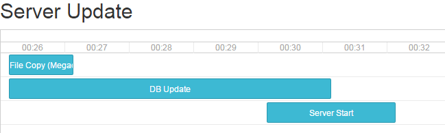

# Upto

Upto is a project based around the observation that in production systems with
many components, it can be very difficult to track and visualize a coordinated
many-step process, especially if the orchestration is distributed or difficult
to monitor. When you get asked why a server startup, build,
deployment, database downtime or other process is slow (or slower than it was),
it can be difficult to track all the moving pieces.

Upto has the intention of solving this by providing a service that you can run and
report events to, either by UDP or HTTP, to provide a Gantt chart visualization and REST API.
As a secondary goal, it would be nice to support both push and pull mechanics,
allowing upto to gather information more easily over a variety of network setups.

The name is based on the question, "what is it up to?" and it is inspired by work
on two projects, one involving many tools, and the other being a build system that
required timings for sub-job level items.

## Status - In Development (not ready for any use)
- [ ] Mock API for designing REST interface
 - [ ] HAL / HATEOAS evaluation
- [ ] UDP binary format
- [ ] Web Interface mk. 1
- [ ] Agent & polling for upto servers behind firewalls
- [ ] CLI for commandline usage
- [ ] Persistence interfaces
 - [ ] Bolt local database implementation
 - [ ] Redis implementation
 - [ ] SQL interface wrapper

## API

The API for upto (served under /api) currently aims to implement
[HAL](http://stateless.co/hal_specification.html)

This is an experiment in providing a discoverable REST API with HATEOAS,
but may be replaced with something else.

**NB:** The very first version of the API will be a mock implementation intended to
flesh out the API design for the interface, rather than a functional implementation.

## CLI

The upto-client folder will have a CLI client implementation that could be used
from within batch scripts, CI systems, packer provisioning scripts etc.

It should eventually be able to use both the HTTP and UDP APIs, but in some cases
sending to an agent, and polling with Upto may be preferred.

## Installation

I use bower to manage the dependencies for the web UI under the content folder.
For development, this brings with it a dependency on Node.js

To build upto, the following (or a variation) is standard:
`call lgo build -ldflags "-X main.extraContentPath src/github.com/Redundancy/upto/content" github.com/Redundancy/upto`

This allows the webserver to default to serving content from the source folders when running from the parent folder of src
