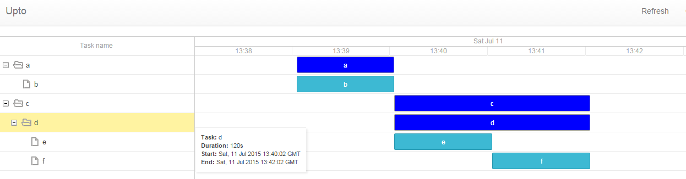

# Upto

Upto is a project based around the observation that in production systems with
many components, it can be very difficult to track and visualize a coordinated
many-step process, especially if the orchestration is distributed or difficult
to monitor. When you get asked why a server startup, build,
deployment, database downtime or other process is slow (or slower than it was),
it can be difficult to track all the moving pieces.

Upto has the intention of solving this by providing a service that you can run and
report events to, either by UDP or HTTP, to provide a Gantt chart visualization and REST API.
As a secondary goal, it would be nice to support both push and pull mechanics,
allowing upto to gather information more easily over a variety of network setups.

The name is based on the question, "what is it up to?" and it is inspired by work
on two projects, one involving many tools, and the other being a build system that
required timings for sub-job level items.

Upto is built to be a micro-service, solving a single problem in a manner that's
decoupled and orthogonal to the use, or other solutions. You should be able to
integrate it and benefit from it easily, without requiring huge changes or forcing
many other choices on you.



## Status - In Development (not ready for any use)
- [x] Mock API for designing REST interface
 - [x] HAL / HATEOAS evaluation
- [x] UDP binary format (alpha)
- [ ] HTTP event API
- [ ] UDP format spec
- [x] Web Interface mk. 1
- [ ] Agent & polling for upto servers behind firewalls
- [x] CLI for commandline usage
- [ ] Persistence interfaces
 - [ ] Bolt local database implementation
 - [ ] Redis implementation
 - [ ] SQL interface wrapper

## Concepts
#### Context
A Context is a collection of similar sets of event timings:
* A service deployment
* A build process

Two different contexts can have overlapping timelines.
The context must be known and set by the client sending events.

#### Timeline
A timeline is a unique set of events that are tracked together within a context.
Examples would be build events for a particular build number, or events for a deployment.

If it makes sense to compare two different ones, or does not make sense to see them
together, you create a new timeline.

Only the newest timeline in a context is active and automatically has events added to it.
The main reason for this is so that systems submitting events may be unaware of
the timeline being used, rather than needing to pass it around as a variable or parameter.

#### Event
An event is a task that *usually* has a duration. Events are organized into
a hierarchy based on naming: "ancestor.parent.eventname" where ancestors have a
duration implied by the start of the first descendant, and the end of the last descendant.

Events may also optionally be tied to specific hosts. This is the only case where
events may share the same name, and the combination of event name and host must
be unique.

Events are sent as start and stop events separately.
There is no onus on the client to track duration.

## API

The API for upto (served under /api) currently aims to implement
[HAL](http://stateless.co/hal_specification.html)

This is an experiment in providing a discoverable REST API with HATEOAS,
but may be replaced with something else.

**NB:** The very first version of the API will be a mock implementation intended to
flesh out the API design for the interface, rather than a functional implementation.

## Transport

The UDP transport is expected to be preferred. If the server is unavailable, events
will simply be lost at no cost to the client execution.

The expectation is that the data transmitted is of very low sensitivity, so the
transport is not secured.

If the HTTP API was used, putting it behind SSL using a trusted HTTPS termination
proxy would be the preferred setup if security is needed.

## Distributed setup

If an appropriate backing datastore is used, then upto is expected to behave statelessly.

## CLI

The upto-client folder will have a CLI client implementation that could be used
from within batch scripts, CI systems, packer provisioning scripts etc.

For remote servers use:
```
upto-client --rh "servername" ...
```
Create a new timeline:
```
upto-client new "context"
```
Start an event using the IP that this machine uses to talk to the server:
```
upto-client -i start "context" "event"
```
Start an event without a hostname:
```
upto-client start "context" "event"
```
Start an event in an implicit hierarchy:
```
upto-client start "context" "ancestor.parent.event"
```
Start an event using the hostname of this machine uses to talk to the server:
```
upto-client -a start "context" "event"
```
End an event (format should match the start event, except for "end")
```
upto-client -i end "context" "event"
```

It should eventually be able to use both the HTTP and UDP APIs, but in some cases
sending to an agent, and polling with Upto may be preferred.

## Installation

I use bower to manage the dependencies for the web UI under the content folder.
For development, this brings with it a dependency on Node.js

Here is my current (windows) build script:
```
@echo off
go build -ldflags "-X main.extraContentPath src/github.com/Redundancy/upto/content" github.com/Redundancy/upto
pushd src\github.com\Redundancy\upto\message
go generate
popd
go build github.com/Redundancy/upto/upto-client
```
The steps for generating the MessagePack functions can be omitted unless you're changing the message package.
This allows the webserver to default to serving content from the source folders when running from the parent folder of src
